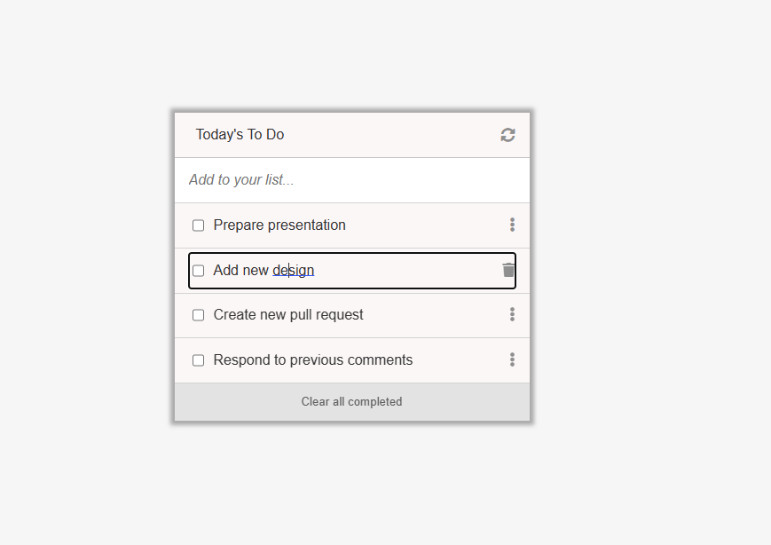

<a name="readme-top"></a>

<div align="center">

  <h3><b>To-Do List </b></h3>

</div>

<!-- TABLE OF CONTENTS -->

# 📗 Table of Contents

- [📖 About the Project](#about-project)
  - [🛠 Built With](#built-with)
    - [Tech Stack](#tech-stack)
    - [Key Features](#key-features)
  - [🚀 Live Demo](#live-demo)
- [💻 Getting Started](#getting-started)
  - [Setup](#setup)
  - [Prerequisites](#prerequisites)
  - [Install](#install)
- [👥 Authors](#authors)
- [🔭 Future Features](#future-features)
- [🤝 Contributing](#contributing)
- [⭐️ Show your support](#support)
- [🙏 Acknowledgements](#acknowledgements)
- [📝 License](#license)

<!-- PROJECT DESCRIPTION -->

# 📖 [To-Do List] <a name="about-project"></a>

**Todo List** is a an application that can be used as a todo list app to add, modify and edit daily tasks.

## 🛠 Built With <a name="built-with"></a>

### Tech Stack <a name="tech-stack"></a>

<details>
  <summary>Client</summary>
  <ul>
    <li>HTML</a></li>
    <li>CSS</a></li>
    <li>JS</a></li>
    <li>Webpack</a></li>
  </ul>
</details>

<!-- Features -->

### Key Features <a name="key-features"></a>

- **List structure designed**
- **Web pack deployed**
- **JavaScript dynamically displays list**
- **List add, read, update and delte functionality deployed**
- **Task Completion interactive response deployed**
- **Clear all completed tasks with one button**
- **Functions add, remove, edit, update and clear tested**

<p align="right">(<a href="#readme-top">back to top</a>)</p>

<!-- Screen Shot -->

## Screen Shot <a name="screen-shot"></a>



<!-- LIVE DEMO -->

## 🚀 Live Demo <a name="live-demo"></a>

- <a href="https://demesameneshoa.github.io/to-do-list/">Click Here</a> to see the live demo

<p align="right">(<a href="#readme-top">back to top</a>)</p>

<!-- GETTING STARTED -->

## 💻 Getting Started <a name="getting-started"></a>

To get a local copy up and running, follow these steps.

### Prerequisites <a name="prerequisites">

In order to run this project you need:

- Visual Studio Code
- Node JS

### Setup <a name="setup">

Clone this repository to your desired folder:

Example commands:

```sh
  mkdir todolist
  cd todolist
  git clone git@github.com:demesameneshoa/to-do-list.git
```

### Insatll <a name="install">

Install webpack and its associated tools as dev dependencies by running the following command

```
npm install webpack webpack-cli webpack-dev-server html-webpack-plugin style-loader css-loader --save-dev
```

<p align="right">(<a href="#readme-top">back to top</a>)</p>

<!-- AUTHORS -->

## 👥 Authors <a name="authors"></a>

👤 **Demes Abera**

- GitHub: [@githubhandle](https://github.com/demesameneshoa)

👤 **lRebornsl**

- GitHub: [@lRebornsl](https://github.com/lRebornsl)

<p align="right">(<a href="#readme-top">back to top</a>)</p>

<!-- FUTURE FEATURES -->

## 🔭 Future Features <a name="future-features"></a>

- [ ] **crete mobile responsive app**

<p align="right">(<a href="#readme-top">back to top</a>)</p>

<!-- CONTRIBUTING -->

## 🤝 Contributing <a name="contributing"></a>

Contributions, issues, and feature requests are welcome!

Feel free to check the [issues page](../../issues/).

<p align="right">(<a href="#readme-top">back to top</a>)</p>

<!-- SUPPORT -->

## ⭐️ Show your support <a name="support"></a>

If you like this project please show us support by givintg it a star.

<p align="right">(<a href="#readme-top">back to top</a>)</p>

<!-- ACKNOWLEDGEMENTS -->

## 🙏 Acknowledgments <a name="acknowledgements"></a>

I would like to thank my colleagues at Microverse for their support during the project.

<p align="right">(<a href="#readme-top">back to top</a>)</p>

<!-- LICENSE -->

## 📝 License <a name="license"></a>

This project is [MIT](./MIT.md) licensed.

<p align="right">(<a href="#readme-top">back to top</a>)</p>
